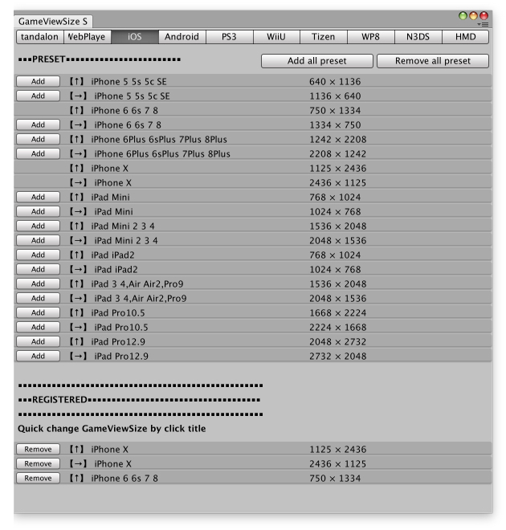
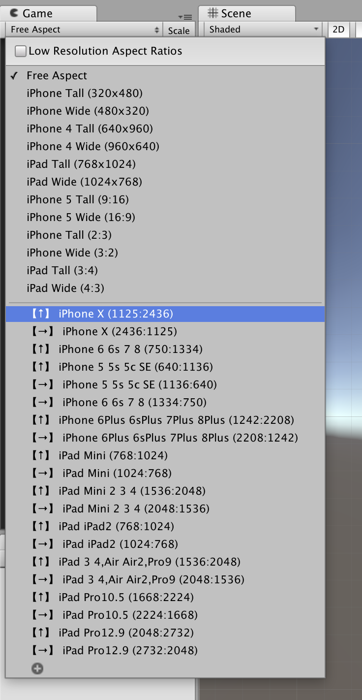

# GameViewSize Settings

Easily register, delete and change GameViewSize in Unity

## Description

It is troublesome to register, delete, or change GameViewSize using the default function of Unity. [GameViewSize Settings] is a tool that can do these easily. We prepare representative terminal sizes of iPhone and Android as presets. You can change GameViewSize with one button. If you want to easily incorporate the screen size necessary for development and debugging please try using this tool.

## Feature
* Register the screen size of a representative smartphone terminal in GameViewSize.
* Delete registered GameViewSize
* Change GameViewSize

## Usage
#### Open EditorWindow
1. MenuItem "Window/GameViewSize Settings"
2. Switch Tab
#### Add GameViewSize
1. Click the "Add" button of the required preset or click the "Add all preset" button
#### Remove GameViewSize
1. Click the "Remove" button of the required preset or click the "Remove all preset" button
#### Change GameViewSize
1. Click the title of each item displayed in the "REGISTERED" area

## Update Preset
Please rewrite "GameViewSizePreset.cs" or Make a issue [GameViewSizeSettings issue](https://github.com/Syy12345-Unity/GameViewSizeSettings/issues)

## Use Library
* [unity-GameViewSizeHelper](https://github.com/anchan828/unity-GameViewSizeHelper)

## Licence

[MIT](https://github.com/tcnksm/tool/blob/master/LICENCE)

## Author

[Syy12345-Unity](https://github.com/Syy12345-Unity)
